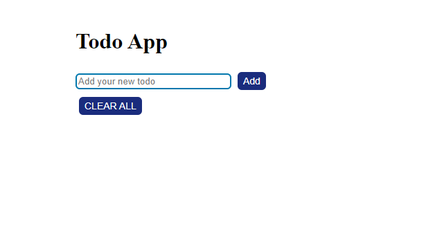
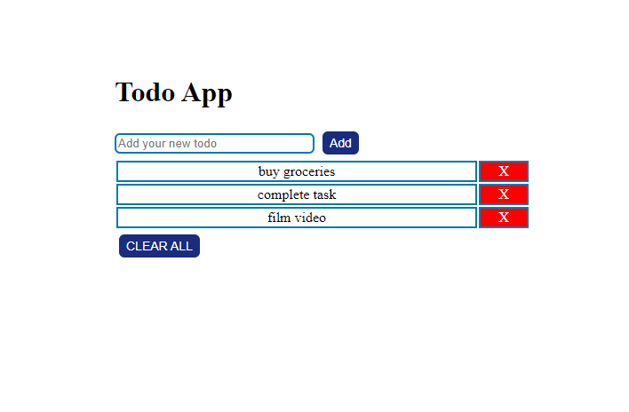
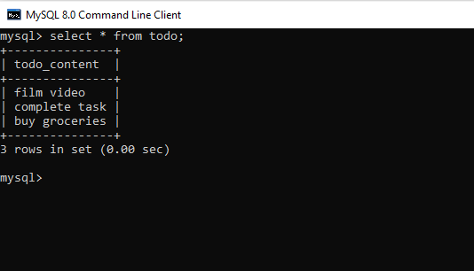

# To-do List App
Website built during Internet Programming Lab Model Examination. Contains options to add, remove and clear all to-do items. The to-do list items are also linked to a MySQL Database, which would perform similar add and clear operations.
 

